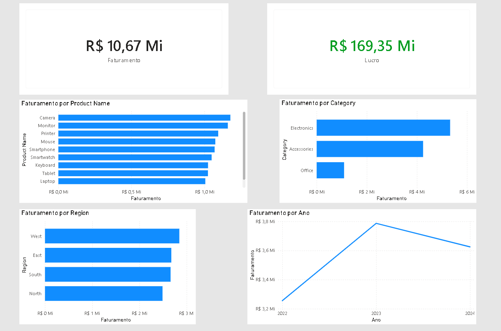

# 📊 Sales Analysis Project (SQL + Power BI)

## 🎯 Overview

This project aims to analyze sales data to generate business insights by evaluating revenue, profit, product performance, and behavior across categories, regions, and time.

The solution was built using SQL for data extraction and transformation and Power BI for data visualization and dashboard development.

---

## 🛠️ Technologies Used

- SQL (MySQL) – data extraction and analysis  
- Power BI – data visualization and dashboard creation  
- Power Query – data cleaning and transformation  
- Excel/CSV – dataset source  

---

## 📊 Analysis Structure

The project includes the following analyses:

- 💰 Total revenue and its evolution over time  
- 💸 Total profit analysis  
- 📦 Top-performing products  
- 📂 Revenue by category  
- 🌍 Revenue by region  

---

## 📈 Dashboard

The dashboard was built in Power BI with a focus on clarity and decision-making, including:

- Key KPIs (Revenue, Profit, and Sales Volume)  
- Time series analysis  
- Region and category performance  
- Product ranking  

📸 Dashboard Preview:

---

## 🧠 Key Insights

- Identification of the highest revenue-generating regions  
- Best-performing products in terms of profit contribution  
- Most relevant sales categories  
- Overall sales growth trend over time  

---

## 🧾 SQL Queries

All SQL queries used for data extraction and analysis are available in:

📁 `/sql/queries.sql`

---

## 📌 Project Structure

Sales-Analysis-Project
 ├── data
 ├── dashboard
 ├── sql
 ├── README.md

---

## 🚀 Project Goal

This project was developed to practice end-to-end data analysis, covering the full pipeline:

Database → SQL → Data Cleaning → Power BI → Business Insights

---

## 🤝 Contributing
Contributions, issues, and feature requests are welcome! Feel free to check the issues page.

## 📎 Author

## Developed by Victor Viapiana  
GitHub: https://github.com/VictorViapiana
